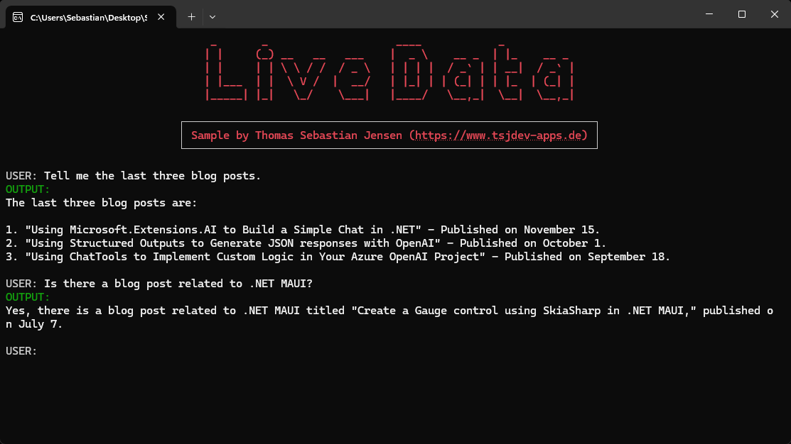

# Add Data from Your Website to Your AI Chat Client

This repository provides a .NET 9 console application that integrates real-time web data into an AI chat client. The application demonstrates how to fetch and process live data from websites, enhancing the chatbot's ability to deliver up-to-date, context-specific responses.

## Features

- **Real-Time Data Integration**: Fetches live data from specified websites to provide current information.
- **AI Chat Client Enhancement**: Incorporates real-time web data into the AI chat client for dynamic interactions.
- **Modular Design**: Utilizes helper classes for streamlined code management and readability.

## Prerequisites

- [.NET 9 SDK](https://dotnet.microsoft.com/en-us/download/dotnet/9.0)
- [Visual Studio 2022](https://visualstudio.microsoft.com/) or any compatible IDE
- [Azure.AI.OpenAI](https://www.nuget.org/packages/Azure.AI.OpenA) NuGet package
- [HtmlAgilityPack](https://www.nuget.org/packages/HtmlAgilityPack) NuGet package
- [Spectre.Console](https://www.nuget.org/packages/Spectre.Console)NuGet package

## Project Strucutre

- `Program.cs`: Entry point of the application.
- `Utils/ConsoleHelper.cs`: Contains methods for enhanced console interactions using `Spectre.Console`.
- `Utils/Statics.cs`: Stores static values such as host URLs and OpenAI model names.
- `Utils/WebsiteHelper.cs`: Provides methods to fetch and clean HTML content from websites.

## Usage

Upon running the application, it will prompt you to enter a website URL. The application will then fetch the HTML content of the specified website, process it, and integrate the data into the AI chat client for dynamic interactions.

## Screenshots

The first step when running the application is for the user to select the host.

After selecting the host, the application guides the user through providing the necessary configuration details.

Before the chat can begin, the user is prompted to provide a URL. This URL serves as a source of additional data for the AI model, enriching its responses with real-time, context-specific information.

Once the website’s content has been added to the AI model, the user is ready to start the chat.

## Blog Posts

If you are more interested into details, please see the following posts on [medium.com](https://medium.com/@tsjdevapps) or in my [personal blog](https://www.tsjdev-apps.de):

- [Add Data from Your Website to Your AI Chat Client](https://medium.com/medialesson/add-data-from-your-website-to-your-ai-chat-client-cee94ffcd1f6)
- [Einrichtung von OpenAI](https://www.tsjdev-apps.de/einrichtung-von-openai/)
- [Einrichtung von Azure OpenAI](https://www.tsjdev-apps.de/einrichtung-von-azure-openai/)
